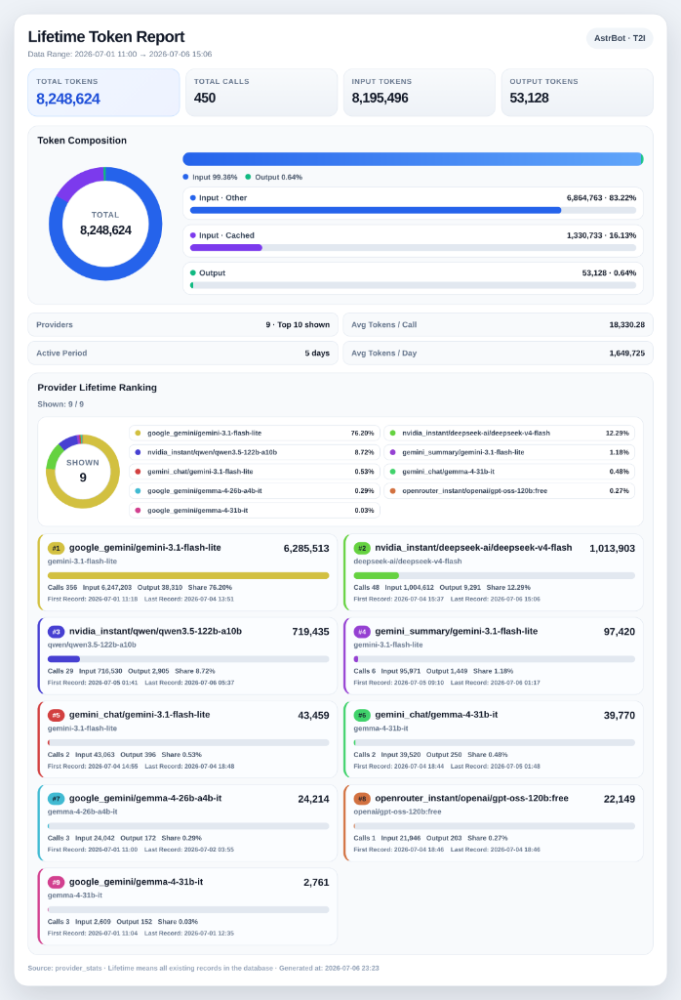

# astrbot_plugin_lifetime_tokens

A small AstrBot plugin that reads the existing `provider_stats` table and reports lifetime token usage.

This version uses a unified design with only two commands.

## Preview



## Commands

```text
/lifetime_report
/lifetime_report_img
```

## Optional config

```yaml
provider_limit: 10
```

- `provider_limit`: how many top providers to show
- default: `10`
- max: `50`

## Output design

### Unified text report

Shows all of the following in one message:

- summary
- token breakdown
- provider ranking
- each provider's first / last record

### Unified image report

Shows all of the following in one image:

- summary cards
- percentage pie chart style token composition
- detailed token breakdown
- provider lifetime ranking
- provider token share pie chart
- each provider's first / last record

## Scope

This plugin only reads records where:

```sql
agent_type = 'internal'
```

It does not modify AstrBot's built-in Dashboard Token Statistics page, and it does not write or delete database records.

## T2I behavior

The image command uses `self.html_render()` to render a styled HTML card through AstrBot T2I.

If custom HTML rendering fails, the plugin falls back to `self.text_to_image()` with the plain text result.

## Install

Put this folder into:

```text
AstrBot/data/plugins/astrbot_plugin_lifetime_tokens/
```

Then reload plugins in AstrBot WebUI.

## Notes

- Lifetime means all existing records in `provider_stats`.
- It cannot recover records that were never saved.
- It does not count external HTTP APIs or plugin-owned direct API calls unless those calls were already recorded in `provider_stats`.


## Rendering updates

- Output image format remains `PNG`
- T2I rendering now uses higher-density settings for sharper output
- Layout spacing is compressed to reduce final image height

## v0.6.0 — T2I image UI overhaul

- All section titles, metric labels, and field names in the image report are
  now bilingual (Traditional Chinese + English), e.g. "Total Tokens 總 Token
  數". Text report (`/lifetime_report`) is unchanged.
- Merged the old "Token Composition" pie section and the separate "Detailed
  Token Breakdown" grid into a single section — the same three numbers were
  previously shown twice.
- Replaced the fixed 11-color provider palette with a golden-angle HSL
  color generator, so up to `MAX_PROVIDER_LIMIT` (50) providers each get a
  visually distinct color instead of repeating.
- Reworked "Provider Lifetime Ranking" from a tall sticky sidebar + list
  layout (which left blank space when the list was longer than the pie
  card) into a horizontal pie + wrapping legend strip above a full-width
  ranked list.
- Each provider row now has a colored left accent and a colored rank badge
  that match its slice in the pie chart above, making the chart-to-list
  mapping clearer at a glance.
- Rank badge text color (black or white) is now chosen automatically based
  on contrast against its background color, so it stays readable for every
  generated hue.
- The "Total Tokens" metric card is now visually emphasized as the primary
  KPI. The header subtitle now shows the record date range instead of
  repeating the `agent_type` filter (still noted in the footer).
- Footer now includes the report generation time.

## v0.6.1

- Reverted the image report back to English-only labels (no bilingual
  Chinese/English text). The text report (`/lifetime_report`) already was
  and remains English/Chinese mixed as before.
- "Provider Lifetime Ranking" now lays out 2 provider cards per row instead
  of 1 (e.g. row 1 = #1 and #2, row 2 = #3 and #4, ...), which roughly
  halves the vertical height of that section for the same provider count.

## v0.6.2

- Fixed a label bug where the pie-chart legend (and the text report's
  provider line) could show the model name twice, e.g.
  `google_gemini/gemini-3.1-flash-lite / gemini-3.1-flash-lite`. This
  happened when `provider_id` was already a compound value ending with the
  model name. Both places now detect that overlap and show it once, e.g.
  `google_gemini/gemini-3.1-flash-lite`.
- The pie-chart legend inside "Provider Lifetime Ranking" now shows exactly
  2 entries per row (grid layout) instead of auto-wrapping 2-3 per row
  depending on label length.

## v0.6.3

- Removed a duplicate-info issue where the header subtitle ("Data Range")
  and the Details grid ("First Record" / "Last Record") showed the exact
  same two dates. The Details grid now shows "Active Period" (day span
  between first and last record) and "Avg Tokens / Day" instead — new
  information rather than a repeat of the header.
- Provider colors (pie slices, legend dots, card accents, rank badges) are
  now assigned based on each provider's identity (`provider_id` +
  `provider_model`, sorted alphabetically), not its position in the
  current total-tokens ranking. Previously, if two providers swapped rank
  between reports (e.g. due to normal usage fluctuation), their colors
  would swap too. Now a given provider keeps the same color across reports
  as long as it stays within the shown set, independent of its rank.

## v0.6.4

- Replaced the "Input Tokens" / "Output Tokens" hero metric cards, which
  duplicated the "Token Composition" section directly below them, with:
  - **Cache Hit Rate** (`input_cached_tokens / input_tokens`) — computed
    before but never actually shown in the image report.
  - **Providers** (distinct provider count), promoted from a line of text
    inside the Details grid to its own hero card. Shows a small "Top N
    shown" caption underneath only when the count is actually truncated.
- Details grid: since "Providers" moved up to the hero row, added
  "Avg Calls / Day" in its place to keep the 2x2 grid balanced.
